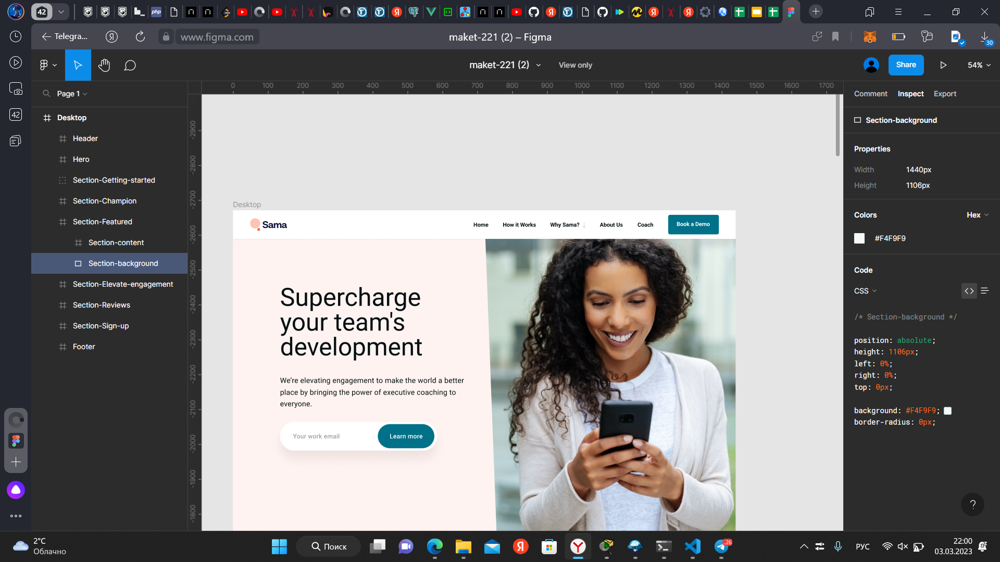
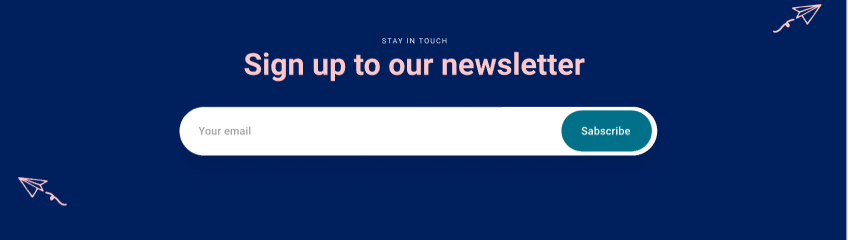

#Человек

##Человек__голова
##Человек__нога

###Человек__глаз-закрыт
###Человек__мышцы-напргяаются
###Человек__нога-двигается

# Header -> header.header>a.header__logo>img.header__img+a.header__link+nav.header__navigation>ul.header__navigation-list>(li.header__navigation-item>a.header__navigation-link)*5+button.header__button

# Cards -> ul.card>(li.card__list>img.card__img>p.card__text>h3.card__content>p.card__data)*3

# Card -> div.card>svg.card__svg*5 + p.card__text>img.card__img+h3.card__name+p.card__geo

# Registration -> div.section>p.section__text+h3.section__header>form.form>label.form__label>input.form__email+button.form__button

